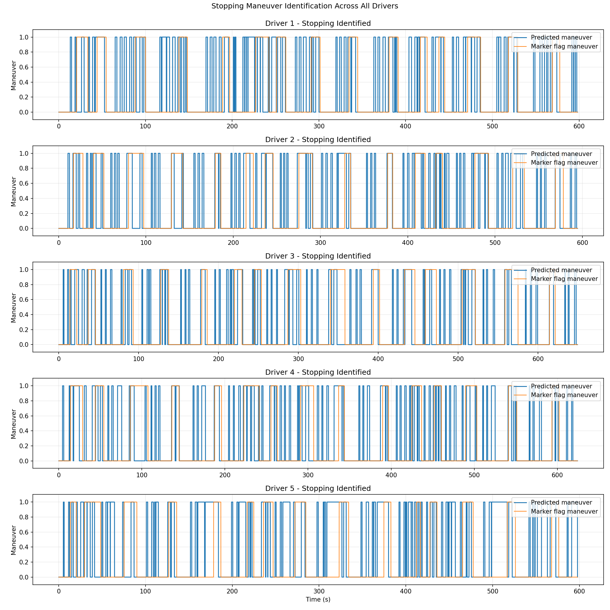
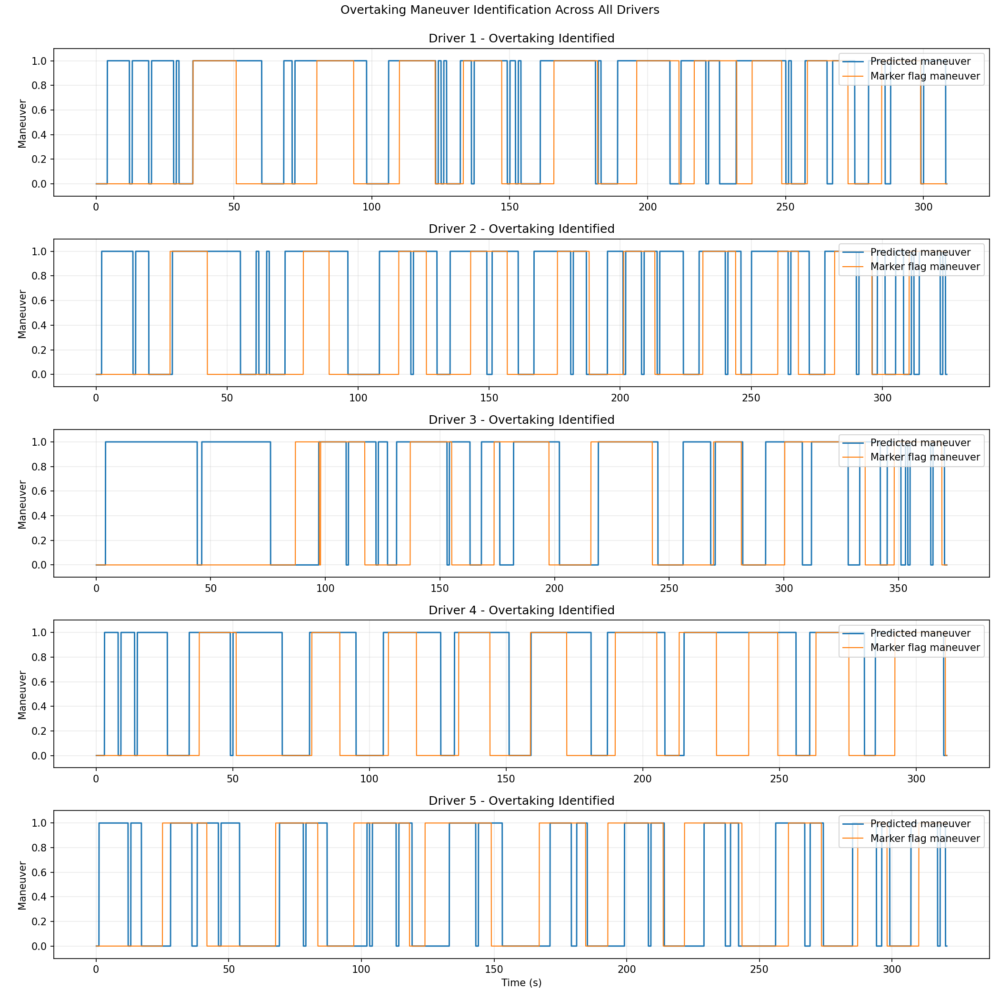
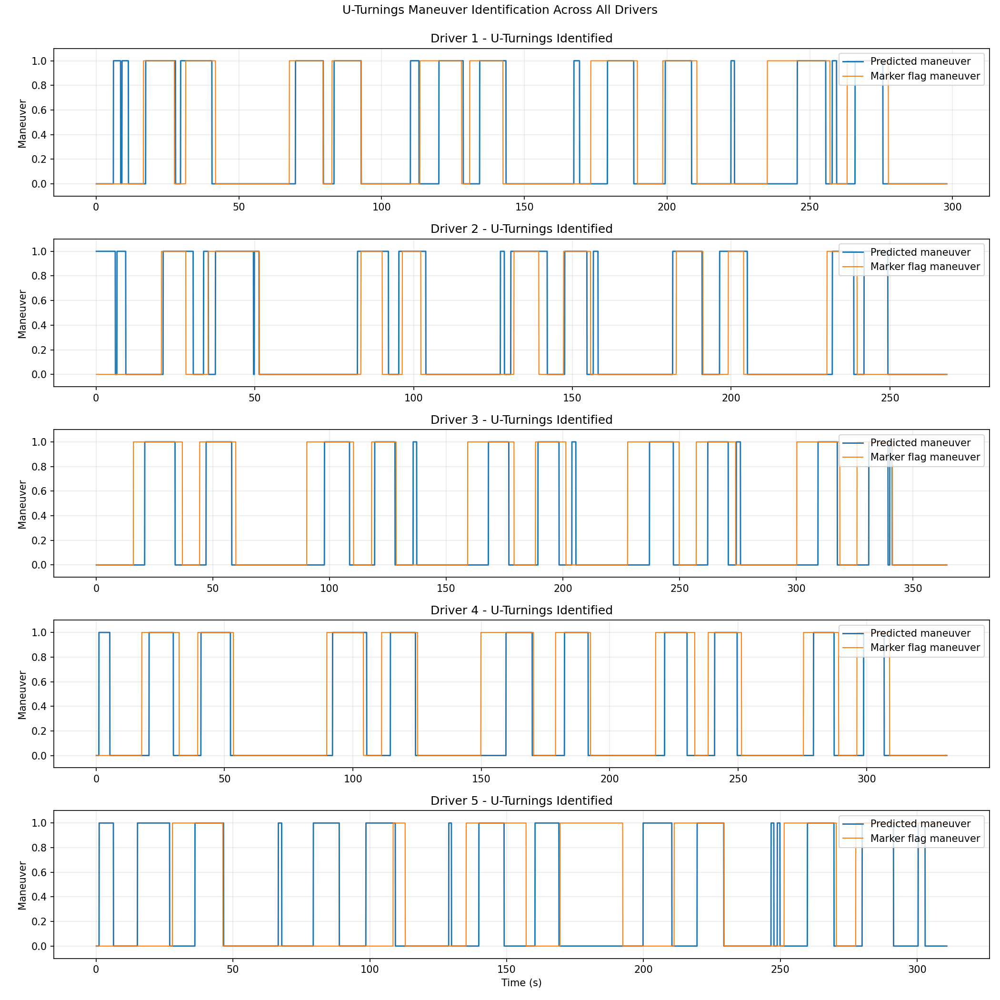

# AAIA Practice 1 - Work Report
## Detailed Fuzzy Inference and Defuzzification

**Author:** Alejandro Iabin Arteaga Hernandez  
**Institution:** Universidad Carlos III de Madrid  
**Email:** 100569025@alumnos.uc3m.es

## Implemented Work and Pipeline
The implemented system detects three maneuvers from simulator telemetry sampled at 20 Hz:

- Stopping
- Overtaking
- U-Turnings

The final solution follows the execution chain below:

1. load telemetry file
2. sort by elapsed time
3. build sliding temporal windows
4. extract window-level features
5. compute fuzzy memberships
6. perform rule aggregation and defuzzification
7. convert fuzzy output to maneuver decision
8. aggregate window decisions to timeline
9. compare predictions with `Maneuver marker flag`

Main implementation files:

- `stopping.py`: orchestration, windowing, voting, plotting, global configuration
- `fuzzy_rules.py`: feature extraction, membership functions, fuzzy antecedents and scoring

Generated outputs:

- `images/stopping_megagraph.png`
- `images/overtaking_megagraph.png`
- `images/u_turnings_megagraph.png`
- `metrics_results.txt`

## Data Preparation and Temporal Segmentation
Data source structure used in the workspace:

- `data/Driver1` to `data/Driver5`
- One Excel file per maneuver and driver

Relevant files:

- `STISIMData_Stopping.xlsx`
- `STISIMData_Overtaking.xlsx`
- `STISIMData_U-Turnings.xlsx`

Main columns used by the final system:

- `Elapsed time`
- `speed`
- `Brake pedal`
- `Gas pedal`
- `Steering wheel angle`
- `Maneuver marker flag`

Preprocessing and segmentation steps applied:

1. Read each Excel file into a data frame.
2. Sort all rows by `Elapsed time`.
3. Generate fixed-length windows in seconds.
4. Discard windows with less than `min_samples`.
5. Keep overlap configurable through:

```math
\text{step_seconds} = \text{window_seconds} \cdot (1 - \text{overlap_ratio})
```

## Feature Engineering Per Window
For each temporal window, the system computes:

- mean acceleration: `mean_acc`
- initial and final speed: `start_speed`, `end_speed`
- speed dynamics: `speed_drop`, `speed_rise`
- mean speed: `mean_speed`
- braking behavior: `mean_brake`, `brake_rise`
- throttle behavior: `mean_gas`
- steering behavior: `mean_steering`, `end_steering`, `max_steering`
- angular magnitude: `mean_abs_steering`
- steering excursion: `steering_range`

These features convert raw signals into interpretable linguistic evidence for fuzzy inference.

## Detailed Fuzzy System Design
### Membership functions
The implementation uses explicit membership mappings to convert crisp feature values into degrees in $[0,1]$.

**1) Positive saturation membership**

```math
\mu_{+}(x; t)=
\begin{cases}
0 & x \le 0 \\
\min\left(\frac{x}{t},1\right) & x>0
\end{cases}
```

Used for evidence that should increase with larger positive values (for example acceleration, speed rise, brake intensity).

**2) Negative saturation membership**

```math
\mu_{-}(x; t)=
\begin{cases}
0 & x \ge 0 \\
\min\left(\frac{|x|}{t},1\right) & x<0
\end{cases}
```

Used for deceleration evidence (negative acceleration).

**3) Linear-below membership**

```math
\mu_{\text{below}}(x; m)=\max\left(0,\min\left(\frac{m-x}{m},1\right)\right)
```

Used to represent linguistic concepts such as *low speed* or *low gas*.

**4) Mid-range triangular membership**
Given interval $[l,h]$, center $c=(l+h)/2$ and half-width $w=(h-l)/2$:

```math
\mu_{\text{mid}}(x;l,h)=\max\left(0, 1-\frac{|x-c|}{w}\right)
```

Used for values expected to be moderate (for example steering activity in overtaking).

### Rule base: Stopping
Stopping combines positive evidence and one penalty:

- decelerating
- reaches near zero speed
- high brake
- brake rise
- intermediate transition
- low gas
- penalty if the window already starts near zero speed

Detailed interpretation of stopping antecedents:

- **Decelerating** captures whether vehicle kinetics are consistent with a braking phase and not with cruising.
- **Reaches near zero speed** captures the temporal trend of a complete stop: start with nonzero speed and approach near-zero speed at the end of the window.
- **High brake** captures sustained brake engagement; this is one of the most discriminative cues in this maneuver.
- **Brake rise** captures the transition from little braking to strong braking, useful for detecting stopping onset.
- **Intermediate transition** captures realistic stopping behavior where the vehicle passes through intermediate speeds while decelerating.
- **Low gas** rejects windows where throttle remains high, reducing confusion with overtaking-like acceleration phases.
- **Start-near-zero penalty** avoids false positives on already-stopped windows that should not be interpreted as active stopping events.

Stopping fuzzy rule base (linguistic):

- **R1:** IF deceleration is high THEN stopping evidence is high.
- **R2:** IF speed starts nonzero AND ends near zero THEN stopping evidence is high.
- **R3:** IF mean brake is high THEN stopping evidence is high.
- **R4:** IF brake increase is high THEN stopping evidence is medium-high.
- **R5:** IF mean speed is intermediate AND deceleration is present AND brake rise is present THEN stopping evidence is medium.
- **R6:** IF gas is low THEN stopping evidence is medium.
- **R7 (penalty):** IF start speed is already near zero THEN stopping evidence must be reduced.

In the final implementation, each rule contributes an activation level and a consequent label (low, medium, or high confidence), then Mamdani max-min aggregation is applied over the output universe.

Let $\alpha_r$ be the firing strength of rule $r$ and $\mu_{C_r}(y)$ the consequent fuzzy set for confidence variable $y\in[0,1]$. The implied output of each rule is:

```math
\mu_r^{\text{out}}(y)=\min\left(\alpha_r,\mu_{C_r}(y)\right)
```

Then all rules are aggregated by:

```math
\mu_{\text{agg}}(y)=\max_r\mu_r^{\text{out}}(y)
```

The crisp stopping confidence is obtained by centroid defuzzification:

```math
S_{\text{stop}}=\frac{\int_0^1 y\,\mu_{\text{agg}}(y)\,dy}{\int_0^1 \mu_{\text{agg}}(y)\,dy}
```

The final decision is:

```math
\hat{y}_{\text{stop}}=\mathbb{1}[S_{\text{stop}}\ge \theta_{\text{stop}}], \quad \theta_{\text{stop}}=0.70
```

### Rule base: Overtaking
Overtaking uses these antecedents:

- acceleration evidence
- speed rise
- sufficiently high mean speed
- high gas
- low brake
- steering activity in a compatible range

Detailed interpretation of overtaking antecedents:

- **Acceleration evidence** captures active engine demand and positive longitudinal dynamics.
- **Speed rise** captures net progression over the window, filtering out short acceleration spikes with no effective gain.
- **High mean speed** enforces contextual plausibility: overtaking is less likely at very low speeds.
- **High gas** strengthens confidence that the driver is intentionally increasing propulsion.
- **Low brake** rejects contradictory control patterns where braking dominates.
- **Steering activity in a compatible range** models that overtaking generally involves non-trivial lateral adjustment, but not the extreme steering profile of a U-turn.

Overtaking fuzzy rule base:

- **R1:** IF acceleration is high THEN overtaking evidence is high.
- **R2:** IF speed rise is high THEN overtaking evidence is high.
- **R3:** IF mean speed is high THEN overtaking evidence is medium.
- **R4:** IF gas is high THEN overtaking evidence is medium-high.
- **R5:** IF brake is low THEN overtaking evidence is medium.
- **R6:** IF steering activity is in the overtaking-compatible range THEN overtaking evidence is medium.
- **R7 (penalty):** IF brake is high THEN overtaking evidence must decrease (low-confidence consequent).

Because overtaking can be confused with other transient behaviors (for example short acceleration bursts), the final system uses Mamdani max-min aggregation and centroid defuzzification instead of direct additive scoring. This reduces linear over-saturation and emphasizes coherent multi-rule support.

Steering activity is modeled as:

```math
\text{steering_activity}=0.6\cdot \text{mean_abs_steering}+0.4\cdot \text{steering_range}
```

Overtaking confidence is computed with the same Mamdani + centroid framework:

```math
S_{\text{over}}=\frac{\int_0^1 y\,\mu_{\text{agg,over}}(y)\,dy}{\int_0^1 \mu_{\text{agg,over}}(y)\,dy}
```

with binary decision:

```math
\hat{y}_{\text{over}}=\mathbb{1}[S_{\text{over}}\ge \theta_{\text{over}}], \quad \theta_{\text{over}}=0.67
```

### Rule base: U-Turnings
U-turning evidence is dominated by steering geometry:

- high mean absolute steering
- high steering range

Detailed interpretation of U-turning antecedents:

- **High mean absolute steering** captures sustained steering commitment over the full window.
- **High steering range** captures large angular sweep, which is characteristic of U-turn execution.

U-turning fuzzy rule base:

- **R1:** IF mean absolute steering is high THEN U-turn evidence is high.
- **R2:** IF steering range is high THEN U-turn evidence is high.
- **R3 (implicit reinforcement):** IF both antecedents are high in the same window THEN combined weighted score exceeds threshold with high confidence.

This subsystem is intentionally compact and interpretable: it favors transparent geometric criteria over a large set of weaker secondary cues.

U-turning confidence is obtained with Mamdani aggregation and centroid defuzzification:

```math
S_u=\frac{\int_0^1 y\,\mu_{\text{agg,u}}(y)\,dy}{\int_0^1 \mu_{\text{agg,u}}(y)\,dy}
```

and the decision is:

```math
\hat{y}_u=\mathbb{1}[S_u\ge \theta_u], \quad \theta_u=0.79
```

## Inference and Defuzzification in This Practice
The final project implementation uses Mamdani fuzzy inference with explicit centroid defuzzification over an output confidence universe in $[0,1]$.

### Fuzzification
Each crisp feature extracted from a window is converted to one or more membership degrees. Example: if a window has moderate positive acceleration, then $\mu_{\text{accelerating}}$ may be around 0.5 while other memberships have different values.

### Rule evaluation and aggregation
Each rule computes a firing strength from antecedent memberships and rule weights. Then:

- implication uses min between firing strength and consequent set
- aggregation uses max across all implied consequents

Output consequents are represented by low/medium/high fuzzy sets (trapezoidal-triangular-trapezoidal).

### Defuzzification
Defuzzification is performed through the centroid of the aggregated output membership:

- compute aggregated output fuzzy set on the confidence universe
- compute centroid to obtain scalar confidence $S\in[0,1]$
- apply a threshold to obtain a binary decision

Therefore, defuzzification in this implementation is the centroid-based mapping of aggregated output fuzzy sets into a crisp maneuver confidence score.

### Temporal defuzzification at timeline level
A second crisping stage is applied after window-level inference:

```math
\text{vote_ratio}(t)=\frac{\text{positive windows covering } t}{\text{total windows covering } t}
```

Then:

```math
\hat{y}(t)=\mathbb{1}[\text{vote_ratio}(t)\ge \tau]
```

This resolves overlap conflicts and converts multiple window outputs into a sample-wise final decision.

## Windowing Strategy and Overlap Analysis
Default configuration:

- Window length: 1.0 s
- Overlap ratio: 0.75 (step = 0.25 s)

Additional configurations used for mandatory analysis:

- Non-overlapping windows: overlap ratio 0.0
- Smaller windows: 0.5 s, overlap 0.75
- Larger windows: 1.5 s, overlap 0.75

## Experimental Protocol and Metrics
Evaluation is computed against `Maneuver marker flag` with:

- Accuracy
- Sensitivity / TPR
- Specificity
- FPR

The script `eval_metrics.py` was executed and the output was saved to `metrics_results.txt`.

## Quantitative Results (Latest Saved Run)

| Maneuver | Configuration | Accuracy | TPR | Specificity | FPR |
|---|---|---:|---:|---:|---:|
| Stopping | 1.0s, overlap 0.75 | 0.6879 | 0.5552 | 0.7366 | 0.2634 |
| Stopping | 1.0s, overlap 0.0 | 0.7248 | 0.4182 | 0.8368 | 0.1632 |
| Stopping | 0.5s, overlap 0.75 | 0.7024 | 0.4659 | 0.7889 | 0.2111 |
| Stopping | 1.5s, overlap 0.75 | 0.6921 | 0.6257 | 0.7167 | 0.2833 |
| Overtaking | 1.0s, overlap 0.75 | 0.6055 | 0.8422 | 0.4315 | 0.5685 |
| Overtaking | 1.0s, overlap 0.0 | 0.6055 | 0.8422 | 0.4315 | 0.5685 |
| Overtaking | 0.5s, overlap 0.75 | 0.6053 | 0.8308 | 0.4395 | 0.5605 |
| Overtaking | 1.5s, overlap 0.75 | 0.6152 | 0.8694 | 0.4272 | 0.5728 |
| U-Turnings | 1.0s, overlap 0.75 | 0.7572 | 0.6407 | 0.8602 | 0.1398 |
| U-Turnings | 1.0s, overlap 0.0 | 0.7542 | 0.5928 | 0.8882 | 0.1118 |
| U-Turnings | 0.5s, overlap 0.75 | 0.7469 | 0.6042 | 0.8671 | 0.1329 |
| U-Turnings | 1.5s, overlap 0.75 | 0.7682 | 0.6812 | 0.8506 | 0.1494 |

## Interpretation Focused on Fuzzy Behavior
### Stopping
Stopping is the most stable subsystem because its antecedents are highly coherent in real driving dynamics: deceleration, brake pressure, and low gas often appear together. This alignment strengthens fuzzy evidence and improves discrimination.

### Overtaking
Overtaking is intrinsically harder because partial patterns appear in non-overtaking situations (brief acceleration, steering corrections, transient gas peaks). For this reason, overtaking required iterative retuning, explicit high-brake penalty logic, and centroid-based defuzzification to reduce over-saturation from simple additive accumulation.

### U-Turnings
U-turning is mainly separable through steering intensity and steering excursion. Its fuzzy behavior is interpretable and robust; however, adding speed-shape evidence could reduce occasional false positives.

### Overlapping vs non-overlapping windows
For Stopping and U-Turnings, overlap improves sensitivity and global accuracy. Non-overlapping windows increase specificity but miss more true maneuver samples.

For Overtaking, overlap comparison has almost no change because the active temporal logic already uses non-overlapping sequencing to enforce start-event behavior.

### Effect of window size
Using 1.5 s windows improves TPR in all three maneuvers, indicating that larger temporal context helps fuzzy evidence accumulate.

Trade-off observed:

- larger windows: better sensitivity, sometimes lower specificity
- smaller windows: higher local specificity, lower sensitivity

### Possible improvements

- Overtaking: add anti-false-positive fuzzy antecedents based on post-peak stabilization and return-to-lane pattern.
- U-Turnings: include speed-reduction and braking evidence jointly with steering to improve precision.
- Add explicit handling of gear transition rule (temporary gear=0 between two gears).
- Tune thresholds per driver or use validation split for robust global parameters.
- Tune output fuzzy set shapes (low/medium/high supports) per maneuver to improve calibration of centroid scores.

## Visual Outputs
The following plots were generated and can be included in the final PDF:

- `images/stopping_megagraph.png`
- `images/overtaking_megagraph.png`
- `images/u_turnings_megagraph.png`

### Stopping predictions vs marker flag across drivers


### Overtaking predictions vs marker flag across drivers


### U-Turnings predictions vs marker flag across drivers


## Reproducibility
Commands used to regenerate the final artifacts:

- `./.venv/bin/python stopping.py`
- `./.venv/bin/python eval_metrics.py > metrics_results.txt`
